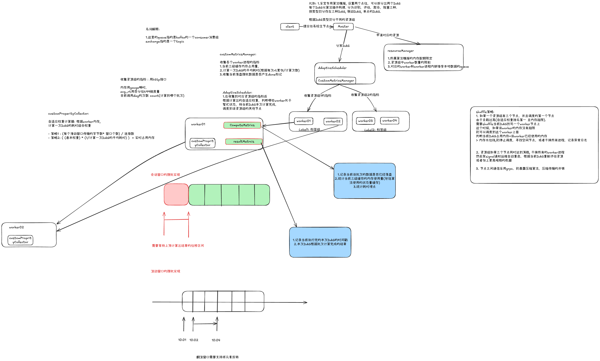

# saber

算法服务框架 - 核心模块

- master只负责数据的接入以及分发给对应的worker节点
- 以设备维度采集的数据进行worker计算进程的隔离
- worker之间需要支持结果的合并(todo 可能需要内部起异步协程进行执行)
- candidate: 汇总节点负责订阅对应的komou的exchange，进行通信

任务提交先到一个资源管理器的地方， 然后由资源管理器分配给对应的点位计算任务相关的worker进程

1) 主进程接受到任务，以设备为维度通过komou队列分发给子进程执行
2) 主进程在接收处，将worker返回的结果通过回调函数做监听, 如果失败记录日志
3) worker进程负责对同一个设备绑定的测点做攒批，联动计算